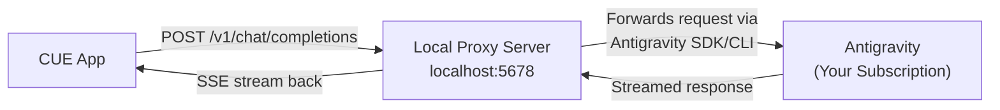

# 🚇 CUE Tunnel API — Proposal & Architecture

## What I Found

**CUE v0.2.2** is an open-source Electron app (Cluely-style invisible AI overlay) that supports **8 LLM providers**:

| Provider | API Format | Auth |
|----------|-----------|------|
| OpenAI | OpenAI Chat Completions | API Key |
| Anthropic | Anthropic Messages API | API Key |
| **Gemini** | Google GenAI SDK | API Key |
| Ollama | Ollama `/api/chat` | No key (URL only) |
| Groq | OpenAI-compatible | API Key |
| MiniMax | OpenAI-compatible | API Key |
| Azure | OpenAI-compatible | API Key + Endpoint |
| **Custom** | OpenAI-compatible | Optional Key + Base URL |

> [!IMPORTANT]
> CUE already has a **"Custom" provider** that accepts any OpenAI-compatible Base URL. This is our golden path — **no CUE source code modification needed**.

## The Plan: Local OpenAI-Compatible Proxy Server



### How It Works

1. **You run a local Node.js server** on `localhost:5678`
2. **In CUE Settings**, select provider = `Custom`, Base URL = `http://localhost:5678/v1`
3. **CUE sends** standard OpenAI `POST /v1/chat/completions` requests to your local server
4. **The proxy intercepts** those requests and routes them through your Antigravity subscription
5. **Streamed responses** flow back to CUE in real-time (SSE format)

### What CUE Sends (from source code analysis)

```json
{
  "model": "antigravity",
  "messages": [
    {"role": "system", "content": "...system prompt + AI rules..."},
    {"role": "user", "content": "What is..."},
    {"role": "user", "content": [
      {"type": "text", "text": "Analyze this screenshot"},
      {"type": "image_url", "image_url": {"url": "data:image/png;base64,..."}}
    ]}
  ],
  "stream": true,
  "max_tokens": 700
}
```

## Feature Mapping

| CUE Feature | How It Works Through Tunnel |
|-------------|---------------------------|
| 💬 **Chat** | Messages forwarded as-is to Antigravity |
| 🎤 **Audio/Mic** | CUE transcribes locally (Whisper) → sends text → tunnel handles text only |
| 🧠 **Smart/Fast toggle** | CUE sends `max_tokens: 1400` (smart) or `700` (fast) — proxy respects it |
| 📋 **AI Rules** | CUE injects into system prompt before sending — tunnel receives it already |
| 🔄 **Follow-up/Recap** | CUE manages conversation turns — tunnel sees multi-turn messages |
| 📜 **History** | CUE stores history locally — no tunnel involvement needed |
| 📸 **Screenshots** | CUE sends base64 images in messages — tunnel forwards them |

## Two Architecture Options

### Option A: Antigravity CLI Pipe (Simplest)
- Proxy receives CUE request → shells out to `agy` CLI → streams response back
- **Pro**: No API key management, uses your existing subscription directly
- **Con**: Higher latency per request, CLI overhead

### Option B: Direct SDK Integration (Recommended)
- Proxy uses the Antigravity Python/JS SDK programmatically
- **Pro**: Lower latency, proper streaming, more control
- **Con**: Needs SDK setup

### Option C: Free Gemini API Key (Easiest — No Tunnel Needed!)
- Google AI Studio offers **free** Gemini API keys at [aistudio.google.com](https://aistudio.google.com)
- The free tier gives you 15 RPM for Gemini 2.5 Flash
- Just paste the key into CUE's settings under Gemini provider
- **Pro**: Zero setup, CUE works natively
- **Con**: Rate limited (15 requests/minute), requires Google account

> [!NOTE]
> **Option C** is worth trying first — CUE's default model (`gemini-2.5-flash`) is explicitly documented as "free-tier available" in CUE's own source code.

## What I Need From You

Before I start building, I need to clarify a few things:
